# HabitFlow – Deployment Documentation

**Course:** CSEC 3 – Cloud Computing  
**Platform:** Render
**Method:** GUI-based deployment with step-by-step screenshots  
**Deployment Type:** Docker container via Render Web Service

---

## 📋 Table of Contents

1. [Prerequisites](#1-prerequisites)
2. [Resource Overview](#2-resource-overview)
3. [Step-by-Step Deployment](#3-step-by-step-deployment)
   - [Step 1 – Prepare the GitHub Repository](#step-1--prepare-the-github-repository)
   - [Step 2 – Create a Render Account](#step-2--create-a-render-account)
   - [Step 3 – Create a New Web Service](#step-3--create-a-new-web-service)
   - [Step 4 – Connect GitHub Repository](#step-4--connect-github-repository)
   - [Step 5 – Configure Service Settings](#step-5--configure-service-settings)
   - [Step 6 – Set Environment Variables](#step-6--set-environment-variables)
   - [Step 7 – Deploy the Application](#step-7--deploy-the-application)
   - [Step 8 – Verify the Live Deployment](#step-8--verify-the-live-deployment)
4. [Cloud Optimizations](#4-cloud-optimizations)
5. [Security Controls](#5-security-controls)
6. [Architecture Summary](#6-architecture-summary)

---

> **Why Docker?**  
   - Create a new user account
# HabitFlow – Deployment Documentation

**Course:** CSEC 3 – Cloud Computing  
**Platform:** Render
**Method:** GUI-based deployment with step-by-step screenshots  
**Deployment Type:** Docker container via Render Web Service

---

## 📋 Table of Contents

1. [Prerequisites](#1-prerequisites)
2. [Resource Overview](#2-resource-overview)
3. [Step-by-Step Deployment](#3-step-by-step-deployment)
   - [Step 1 – Prepare the GitHub Repository](#step-1--prepare-the-github-repository)
   - [Step 2 – Create a Render Account](#step-2--create-a-render-account)
   - [Step 3 – Create a New Web Service](#step-3--create-a-new-web-service)
   - [Step 4 – Connect GitHub Repository](#step-4--connect-github-repository)
   - [Step 5 – Configure Service Settings](#step-5--configure-service-settings)
   - [Step 6 – Set Environment Variables](#step-6--set-environment-variables)
   - [Step 7 – Deploy the Application](#step-7--deploy-the-application)
   - [Step 8 – Verify the Live Deployment](#step-8--verify-the-live-deployment)
4. [Cloud Optimizations](#4-cloud-optimizations)
5. [Security Controls](#5-security-controls)
6. [Architecture Summary](#6-architecture-summary)

---

## 1. Prerequisites

Before deploying, make sure you have the following ready:

- A GitHub account with the HabitFlow repository pushed and accessible
- A Render account (free tier) — sign up at [https://render.com](https://render.com)
- The project must include a `Dockerfile` in the root directory *(already included in this repo)*

The project's `Dockerfile` is configured as follows:

```dockerfile
FROM python:3.11-slim

RUN apt-get update && apt-get install -y --no-install-recommends curl \
    && rm -rf /var/lib/apt/lists/*

WORKDIR /app
COPY requirements.txt .
RUN pip install --no-cache-dir -r requirements.txt
COPY . .

EXPOSE 8080
ENV FLET_WEB=1
ENV PORT=8080
ENV DATABASE_PATH=/tmp/habitflow.db

CMD ["uvicorn", "asgi:app", "--host", "0.0.0.0", "--port", "8080"]
```

This tells Render to:
- Use Python 3.11 as the base runtime
- Install all dependencies from `requirements.txt`
- Run the app as a web service on port 8080 using `uvicorn`

---

## 2. Resource Overview

| # | Resource | Service | Purpose |
|---|---|---|---|
| 1 | Web Service | Render Web Service | Hosts and runs the HabitFlow Python application |
| 2 | SQLite Database | Render Ephemeral Storage (`/tmp`) | Stores user data, habits, and completion records |
| 3 | Environment Variables | Render Environment Config | Stores app secrets and configuration securely |
| 4 | Auto-Deploy Pipeline | Render + GitHub Integration | Automatically redeploys on every GitHub push (CI/CD) |

**Security boundary:**
- All traffic is served over **HTTPS** (TLS auto-provisioned by Render)
- Environment variables are **private** and never exposed in the codebase
- The `/tmp` storage path is **internal only** — not publicly accessible

---

## 3. Step-by-Step Deployment

### Step 1 – Prepare the GitHub Repository

Ensure the following files exist in the root of your repository before deploying:

| File | Purpose |
|---|---|
| `Dockerfile` | Tells Render how to build and run the app |
| `requirements.txt` | Lists all Python dependencies |
| `asgi.py` | Entry point for the uvicorn web server |
| `.env.example` | Template for required environment variables |
| `.gitignore` | Ensures `.env` and `habitflow.db` are not committed |

> 📸 **Screenshot 01** – GitHub repository root showing these files present  
> *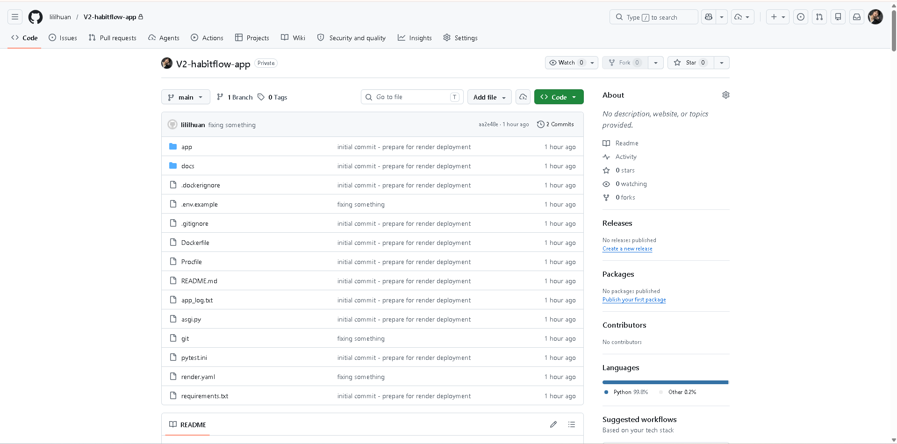*

---

### Step 2 – Create a Render Account

1. Go to [https://render.com](https://render.com)
2. Click **Get Started for Free**
3. Sign up using your GitHub account — this makes connecting your repository easier
4. Once logged in, you will land on the Render Dashboard

> 📸 **Screenshot 02** – Render dashboard after login  
> *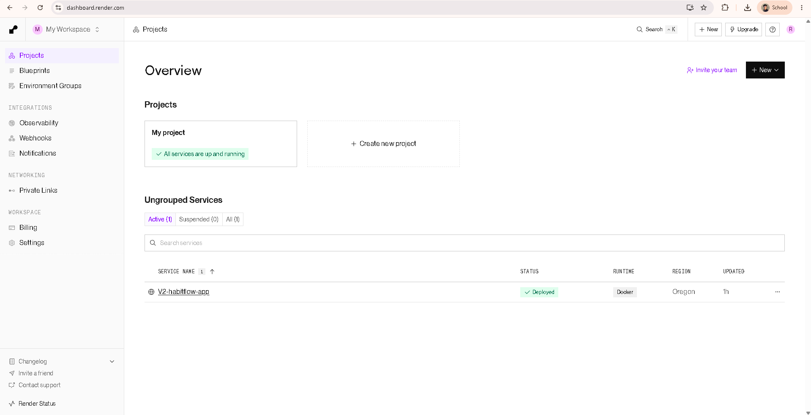*

---

### Step 3 – Create a New Web Service

1. From the Render Dashboard, click **New +**
2. Select **Web Service** from the dropdown menu
3. On the next screen, choose **Build and deploy from a Git repository**
4. Click **Next**

> 📸 **Screenshot 03** – Render "New Web Service" creation screen  
> *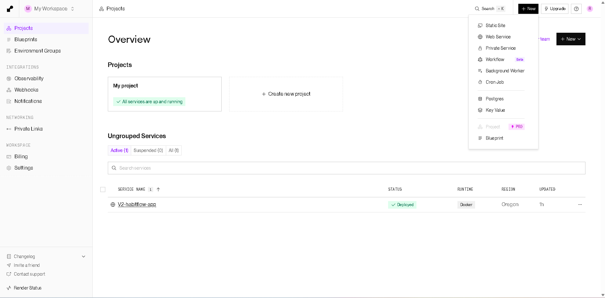*


---

### Step 4 – Connect GitHub Repository

1. Render will prompt you to connect your GitHub account if not already connected
2. Click **Connect GitHub**
3. Authorize Render to access your repositories
4. Search for and select the **habitflow-app** repository
5. Click **Connect**

> 📸 **Screenshot 04** – GitHub repository connected to Render  
> *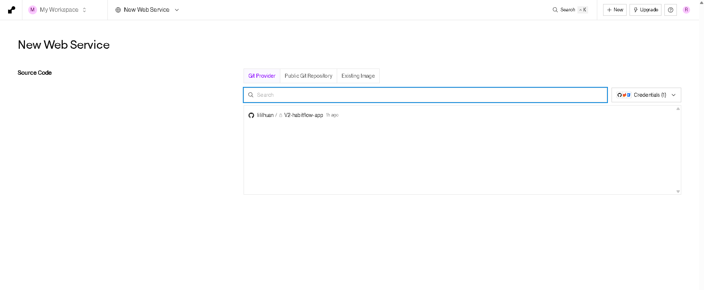*

---

### Step 5 – Configure Service Settings

Fill in the following settings on the service configuration page:

| Setting | Value | Reason |
|---|---|---|
| **Name** | `habitflow-app` | Identifier for the service |
| **Region** | Singapore (Southeast Asia) | Closest region to the Philippines |
| **Branch** | `main` | Production branch of the repository |
| **Runtime** | Docker | Uses the project's existing Dockerfile |
| **Instance Type** | Free | Sufficient for academic deployment |

> **Why Docker?**  
> The project already includes a `Dockerfile` that properly configures the Python environment, installs dependencies, and starts the uvicorn server. Using Docker ensures consistency between local development and the cloud environment.

> 📸 **Screenshot 05** – Service configuration settings filled in  
> *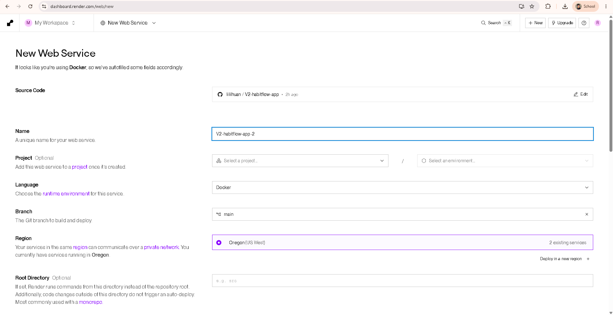*
> *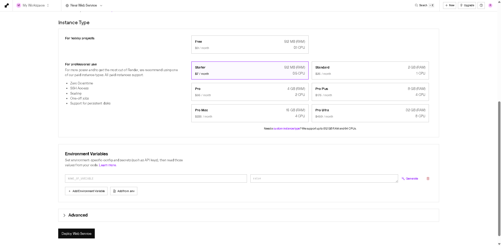*
---

### Step 6 – Set Environment Variables

Before deploying, configure the required environment variables. These replace the local `.env` file and keep secrets out of the codebase.

1. Scroll down to the **Environment Variables** section on the configuration page
2. Add the following key-value pairs:

| Key | Value | Notes |
|---|---|---|
| `FLET_WEB` | `1` | Enables web mode instead of desktop mode |
| `PORT` | `8080` | Port the app listens on |
| `DATABASE_PATH` | `/tmp/habitflow.db` | SQLite database path on Render |
| `MAX_FAILED_ATTEMPTS` | `5` | Account lockout threshold |
| `LOCKOUT_DURATION_MINUTES` | `15` | Lockout duration in minutes |
| `SESSION_TIMEOUT_MINUTES` | `30` | Auto-logout after inactivity |
| `DEBUG_MODE` | `False` | Disable debug output in production |
| `ADMIN_EMAILS` | `admin@gmail.com` | Comma-separated admin accounts |

> ⚠️ **Security Note:** Never commit your `.env` file to GitHub. The `.gitignore` in this project already excludes it. All sensitive values are stored securely in Render's environment variable manager and injected at runtime.


---

### Step 7 – Deploy the Application

1. Click **Create Web Service**
2. Render will begin building the Docker container — this takes 2–5 minutes on first deploy
3. You can watch the build logs in real time on the Render dashboard
4. A successful build ends with the message:  
   `==> Your service is live 🎉`

**What happens during the build:**
1. Render pulls the code from your GitHub `main` branch
2. It runs `docker build` using your `Dockerfile`
3. Python dependencies from `requirements.txt` are installed
4. The container starts with `uvicorn asgi:app --host 0.0.0.0 --port 8080`
5. Render assigns a public HTTPS URL to the service

> 📸 **Screenshot 07** – Render build logs showing successful deployment  
> *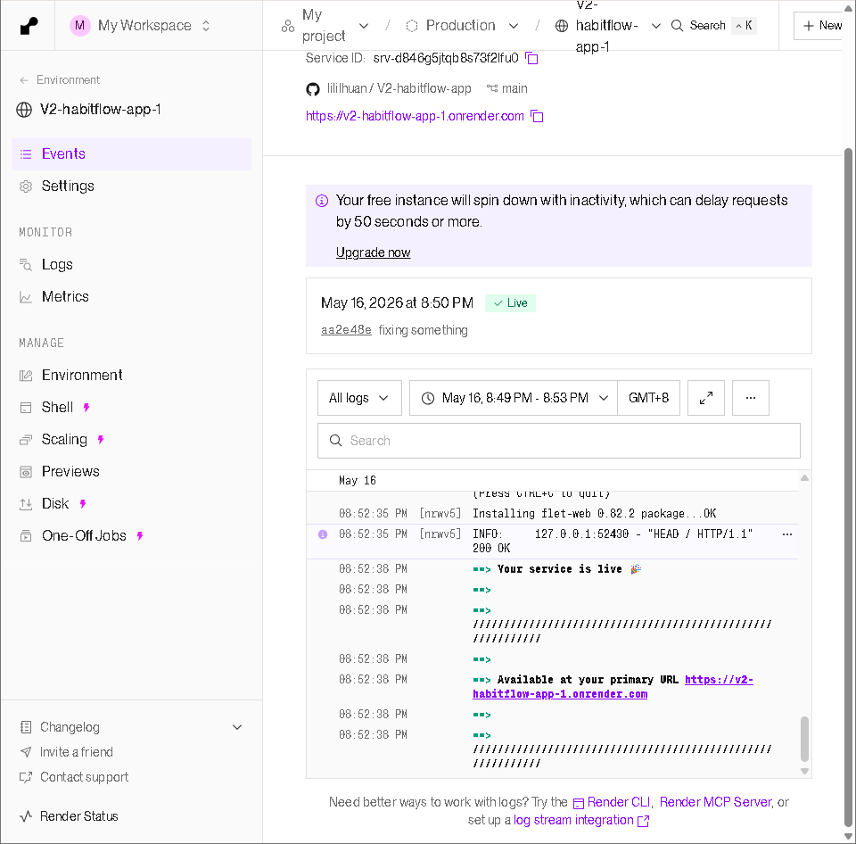*

---

### Step 8 – Verify the Live Deployment

1. Once the build completes, click the **live URL** shown at the top of the service page (format: `https://v2-habitflow-app.onrender.com`)
2. The HabitFlow Welcome screen should load in the browser
3. Test the following to confirm full functionality:
   - Create a new user account
   - Add a habit and check it off
   - View the Analytics screen
   - Export data from Settings

> 📸 **Screenshot 08** – Live HabitFlow app running in the browser  
> *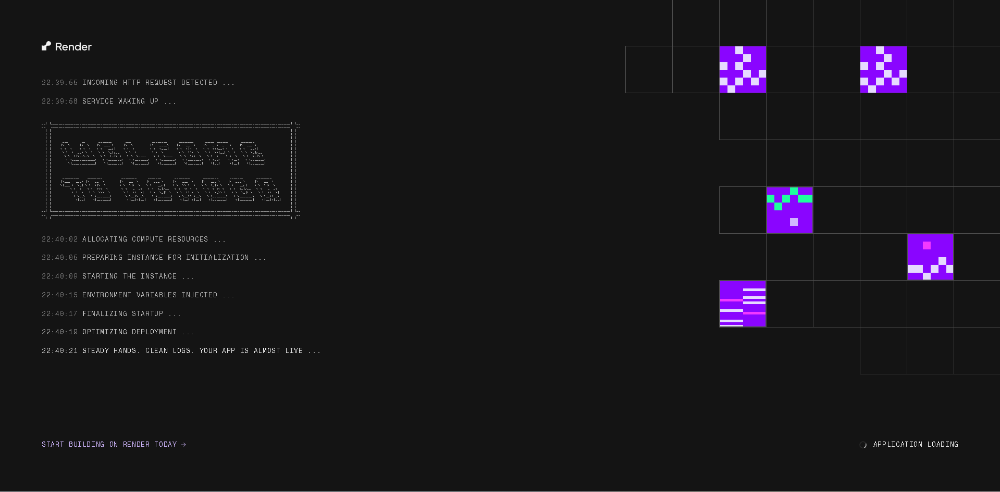*

> 📸 **Screenshot 09** – Render service overview page showing live status and public URL  
> *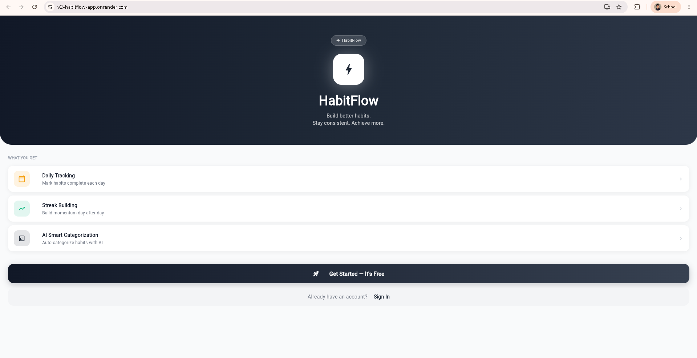*

---

## 4. Cloud Optimizations

### Optimization 1 — Automated CI/CD via GitHub Integration

Render automatically redeploys the application whenever a new commit is pushed to the `main` branch. This eliminates manual deployments and ensures the live app always reflects the latest code.

**How to verify:**
1. Go to your Render service dashboard
2. Click the **Deploys** tab
3. Each entry in the list corresponds to a GitHub push — Render detected the change, rebuilt the container, and redeployed automatically

> 📸 **Screenshot 10** – Render Deploys tab showing automated deployment history  
> *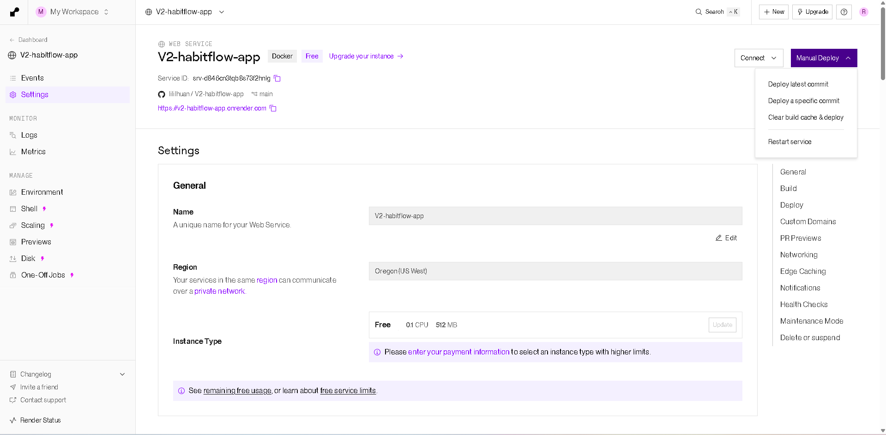*

---

### Optimization 2 — HTTPS / Automatic TLS Encryption

Render automatically provisions a free TLS certificate for every web service. All traffic between users and HabitFlow is encrypted over HTTPS — no manual certificate setup required.

**How to verify:**
1. Open the live app URL in a browser
2. Click the padlock icon in the address bar
3. The certificate should show as valid and issued for the Render domain

> 📸 **Screenshot 11** – Browser showing HTTPS padlock on the live HabitFlow URL  
> *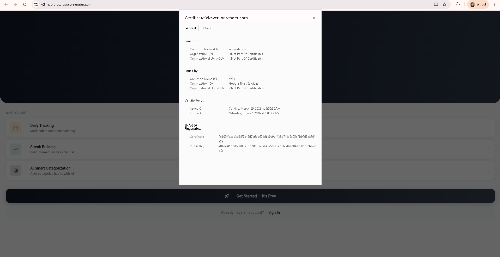*

---

## 5. Security Controls

| Control | Implementation | Where Configured |
|---|---|---|
| HTTPS / TLS | Auto-provisioned SSL certificate | Render (automatic) |
| No hardcoded secrets | All sensitive values in environment variables | Render Environment tab |
| Password hashing | bcrypt encryption for all user passwords | Application code (`auth_service.py`) |
| Account lockout | 5 failed attempts = 15-minute lockout | Environment variable `MAX_FAILED_ATTEMPTS` |
| Session timeout | Auto-logout after 30 minutes of inactivity | Environment variable `SESSION_TIMEOUT_MINUTES` |
| Role-based access | Admin dashboard restricted to admin emails | Environment variable `ADMIN_EMAILS` |

---

## 6. Architecture Summary

```
[ User's Browser ]
            |
            | HTTPS (TLS auto-provisioned)
            ↓
[ Render Web Service (habitflow-app) ]
   - Runtime: Docker (Dockerfile → Python 3.11)
   - App server: uvicorn (asgi:app)
   - Frontend: Flet
   - Port: 8080
   - Region: Oregon (US West)
            |
            | reads/writes
            ↓
[ SQLite Database (/tmp/habitflow.db) ]
   - Ephemeral on Render Free tier; switch to persistent disk on paid plans
   - Stores user accounts, habits, and records
       
[ GitHub Repository (main) ] ──── auto-deploy on push ──→ [ Render Web Service ]
```

**Public components:** Render Web Service (public HTTPS URL)
**Private components:** SQLite database file, environment variables, application logs

---

*Documentation prepared for CSEC 3 – Cloud Computing, AY 2025–2026, 2nd Semester*  
*Camarines Sur Polytechnic Colleges*
